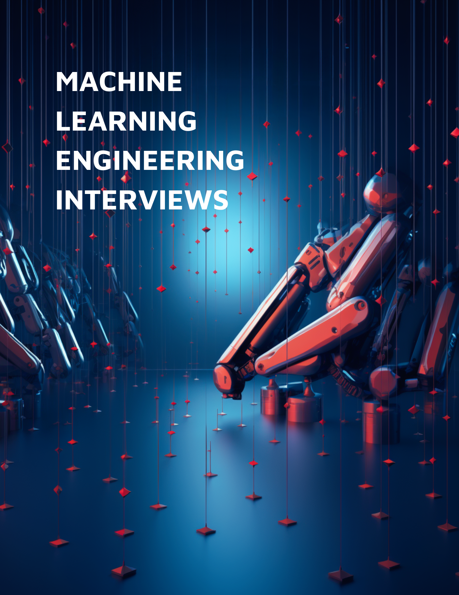

       
# Machine Learning Technical Interviews :robot: 

:newspaper: **News: Updated in 2025**: I have added a new repo for [Agentic AI Systems](https://github.com/alirezadir/Agentic-AI-Systems.git), including the latest trends in AI engineering and agentic systems design and development, for those who are interested. You can find a variety of resources, system design summaries, and hands-on coding examples, projects, and more. 

This repo aims to serve as a guide to prepare for **Machine Learning (AI) Engineering** interviews for relevant roles at big tech companies (in particular FAANG). It has compiled based on the author's personal experience and notes from his own interview preparation, when he received offers from Meta (ML Specialist), Google (ML Engineer), Amazon (Applied Scientist), Apple (Applied Scientist), and Roku (ML Engineer).

The following components are the most commonly used interview modules for technical ML roles at different companies. We will go through them one by one and share how one can prepare:

 |Chapter | Content|
 |---| --- |
 | Chapter 1 	|  [General Coding (Algos and Data Structures)](src/lc-coding.md)	   | 
| Chapter 2 	| [ML Coding](src/MLC/ml-coding.md) 	|  	
| Chapter 3	| [ML Fundamentals/Breadth](src/ml-fundamental.md)| 
| Chapter 4 	| [ML System Design (Updated in 2023)](src/MLSD/ml-system-design.md)|
| Chapter 5 	| [*Agentic AI Systems (2025)*](https://github.com/alirezadir/Agentic-AI-Systems.git)|
| Chapter 6 	| [Behavioral](src/behavior.md)| 

|  	|  	|  

**Notes:**
* At the time I'm putting these notes together, machine learning interviews at different companies do not follow a unique structure unlike software engineering interviews. However, I found some of the components very similar to each other, although under different naming.

* The guide here is mostly focused on *Machine Learning Engineer* (and Applied Scientist) roles at big companies. Although relevant roles such as "Data Science" or "ML research scientist" have different structures in interviews, some of the modules reviewed here can be still useful. 
<!-- For more understanding about different technical roles within ML umbrella you can refer to [Link](https://www.linkedin.com/pulse/machine-learning-engineer-vs-applied-scientist-whats-difference-suresh/) -->

* As a supplementary resource, you can also refer to my [Production Level Deep Learning](https://github.com/alirezadir/Production-Level-Deep-Learning) repo for further insights on how to design deep learning systems for production. 

# Contribution
* Feedback and contribution are very welcome :blush: 
**If you'd like to contribute**, please make a pull request with your suggested changes). 
