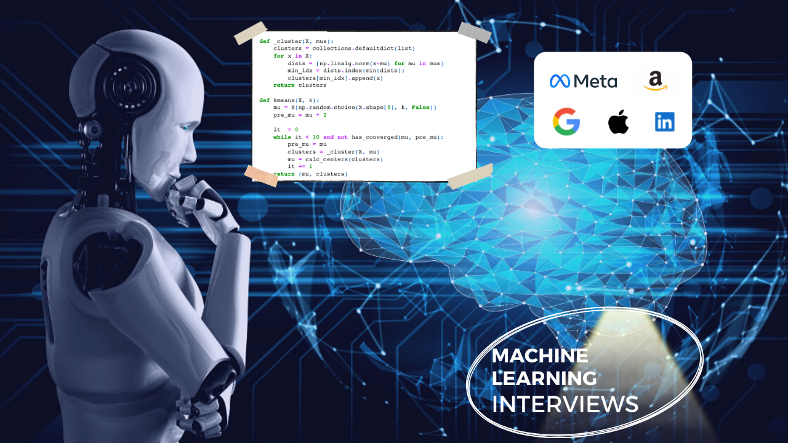

<!-- 

 -->

# A Guide for Machine Learning Technical Interviews (FAANG Companies):robot: 

This repo aims to serve as a guide to prepare for **Machine Learning (AI) engineer** interviews for roles at big tech companies (in particular FAANG). It has compiled based on authors personal experience and notes from his own interview preparation in 2020, when he received offers from Facebook (ML Specialist), Google (ML Engineer), Amazon (Applied Scientist), Apple (Applied Scientist), and Roku.

Notes:

* At the time I'm putting these notes together, machine learning interviews at different companies do not follow a unique structure unlike software engineering interviews. However, I found some of the components very similar to each other, although under different naming.

* The guide here is mostly focused on *Machine Learning Engineer* (and Applied Scientist) roles at big companies. Although relevant roles such as "Data Science" or "ML research scientist" have different structures in interviews, some of the modules reviewed here can be still useful. For more understanding about different technical roles within ML umbrella you can refer to [Link]

* As a supplementary resource, you can also refer to my [Production Level Deep Learning](https://github.com/alirezadir/Production-Level-Deep-Learning) repo for further insights on how to design deep learning systems for production. 

The following components are the most commonly used interview modules for technical ML roles at different companies. We will go through them one by one and share how one can prepare:

|  	|  	|  
|---	|---	|
| 1 	| [General Coding (Algos and Data Structures)](lc-coding.md)	   | 
| 2 	| [ML/Data Coding](ml-coding.md) 	|  	
| 3 	| [ML System Design](ml-system-design.md)|
| 4 	| [ML Depth](ml-depth.md) 	|  	
| 5 	| [ML Breadth](ml-breadth.md)| 
| 6 	| [Behavioral](behavior.md)| 
|  	|  	|  

# Contribution
* Feedback and contribution are very welcome :blush: 
**If you'd like to contribute**, please make a pull request with your suggested changes). 